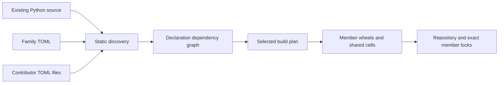

# Building families from existing Python

The authored unit is a small TOML declaration plus ordinary Python source. The build system discovers definitions, merges contributor annotations, resolves source dependencies, and produces independent publication units. It does not require contributors to rewrite working algorithms into a new application framework.



## Authoring and contribution

`mf init` writes a discovery declaration from an existing source project. It reads source and `pyproject.toml`; it does not import the package. A standalone file is convenient for adapting a copied project:

```bash
mf init path/to/project --package existing_package --family algorithms --publisher alice \
  --out families/algorithms/family.toml
```

```toml
schema_version = 1

[publisher]
name = "alice"

[family]
name = "algorithms"
version = "0.1.0"
description = "Reusable algorithms and shared representations"

[source]
root = "../../projects/existing-project/src"
package = "existing_package"
license_files = ["../../projects/existing-project/LICENSE"]

[discovery]
public = true
include = ["**/*.py"]
exclude = ["experimental/*.py"]

[contributions]
include = ["members/**/*.toml"]

[context]
solves = ["Describe the problem space shared by this family"]
```

The same configuration can live under `[tool.module-families]` in an existing `pyproject.toml`: nest `publisher`, `family`, `source`, and the other tables beneath that tool table. Authored family configuration must be TOML and must declare its publisher. JSON is generated interchange for indexes, locks, and responses. This coexists with the project's current packaging backend. `mf build` is the family build frontend; this implementation does not supply a PEP 517 backend that returns multiple independently installable wheels from one hook.

Source and license paths are relative to the root manifest. Discovery patterns are relative to the source package directory. Contribution patterns are relative to the root manifest directory. Empty wildcard matches allow an initial family with no annotations; a missing explicitly named contribution file is an error.

Discovery finds public top-level functions and classes in public source paths. Private paths and definitions are omitted from the default publication inventory. Explicit declarations can expose another source binding by giving its `symbol`. Discovery exclusions control publication roots, **not compiler analysis**. An optional `source.modules` list scopes compilation to explicit Python module names; referenced internal support modules must be included. Without this scope, unsupported source anywhere in the package blocks analysis.

An agent or contributor can draft a focused annotation:

```bash
mf scaffold families/algorithms/family.toml --member alice.temporal.recency_decay
```

```toml
# members/temporal.recency_decay.toml
[[members]]
id = "temporal.recency_decay"
kind = "algorithm"
version = "1.2.0"
solves = ["Convert an age into a freshness ranking signal"]
use_when = ["A freshness policy has an explicit half-life"]
avoid_when = ["Freshness is being used as evidence of factual correctness"]
effects = []
```

The source provides its symbol and summary. Local annotation IDs are qualified with the declared publisher: `temporal.recency_decay` becomes `alice.temporal.recency_decay`, which is the build and repository selector. The annotation supplies intent and assertions that static inspection cannot establish. Missing effects mean `unknown`, not purity. A generated contribution is a draft; creating it does not establish the truth of its claims. Existing manifests and contribution files are protected from accidental overwrite.

Each file may contain several `[[members]]` tables. Teams can organize files by algorithm, contributor, subdomain, or adaptation. Globs collect them deterministically, with no central list to edit for each contribution. Duplicate explicit IDs, normalized distribution-name collisions, and contribution paths escaping the manifest tree are errors. A root declaration and a fragment cannot both explicitly declare the same ID; edit the existing declaration instead of creating a competing override.

One build may register several disjoint package trees using `[sources.alias]` tables instead of `[source]`. Each table supplies `root`, `package`, optional `modules`, and optional `license_files`. The compiler resolves supported internal imports across those roots in one graph; discovery prefixes local IDs with the source alias. Source checkout remains an explicit operation. Independent publishers can also build from separate repositories and contribute their own qualified members to an existing family through the authenticated repository, without family-owner approval. Matching immutable family context and publisher ownership rules still apply.

## Dependencies, types, and adaptation

Source dependencies and module requirements answer different questions. A source dependency determines the bytes and Python objects needed to execute a selected implementation. A named module requirement describes a substitutable component needed to construct a behavior.

Ordinary import roots map explicitly to distribution requirements:

```toml
[external_dependencies]
numpy = "numpy>=1.26"
torch_geometric = "torch-geometric>=2"

[dynamic_dependencies]
"existing_package.solvers:select_backend" = ["networkx>=3.2"]
```

`init` proposes mappings from upstream dependency metadata. Distribution names and import names can differ; the mapping needs review. The compiler infers ordinary internal references, traces supported literal dynamic imports, and requires declarations for variable dynamic loading. Native extensions and external Python packages remain ordinary dependency requirements.

A contributor can declare an existing adapter's module interface and named dependencies:

```toml
[[members]]
id = "adapters.audited_processor"
symbol = "existing_package.adapters:audited_processor"
kind = "functor"
provides = { id = "payments.processor", version = "1" }
requires = { processor = { id = "payments.processor", version = "1" }, ledger = { id = "payments.ledger", version = "1" } }
sharing = [["processor.Receipt", "ledger.Receipt"]]
effects = ["dependency-effects"]
```

This example specifies a declaration shape; it does not generate an adapter or establish its behavior. Root `[[interfaces]]` tables publish reusable signature specifications independently of implementations, including interface-only releases. A `kind = "module"` member can group several source bindings in an `exports` mapping, allowing a shared type library to expose multiple class objects together. The compiler retains this metadata, repository resolution and capability synthesis construct admissible expression candidates, and the contract runtime checks supported interfaces and nominal sharing. Reusing a type through a shared source cell preserves its Python identity. Exact contract references and matching type identity do not prove behavioral substitutability.

When existing software relies on unsupported reflection, imperative package initialization, old import paths, or incompatible data representations, adaptation is an explicit source change or wrapper with relevant validation. The build system reports the boundary. It does not invent semantic equivalence or silently remove required effects. See the [compiler subset](compiler.md) and [module theory proposal](RESEARCH.md).

## Build plans and independent artifacts

```bash
mf validate families/algorithms/family.toml
mf plan-build families/algorithms/family.toml \
  --member alice.temporal.recency_decay --out .mf/recency-plan.json
mf build families/algorithms/family.toml \
  --member alice.temporal.recency_decay --out dist/recency
```

The plan reports inventory size, selected members, source binding relationships, root and supporting cells, exact internal cell dependencies, external requirements, and expected artifact counts. It uses the same source analysis as the build. A blocked plan carries its first error and exits unsuccessfully; it is not an exhaustive repair plan. Both planning and building leave candidate code unexecuted.

The compiler groups mutually dependent definitions into strongly connected cells. Shared supporting definitions are emitted once per selected closure. A member facade depends on its root cells, and internal cell requirements are exact. Selecting one algorithm does not install its entire family.

Wheels are deterministic. An unchanged wheel is verified by comparing its full bytes and left in place, preserving its modification time. An unrelated source edit can leave a selected closure unchanged; a shared dependency edit changes the dependent cells. Builds cache complete source analysis under `out/.cache`, or an explicit `--cache` directory. Planning can use the same cache when `--cache` is supplied. Each lookup hashes the selected source files, compiler implementation, interpreter identity, scopes, and dependency declarations. An unchanged key reuses analysis; a changed input invalidates the entire cached graph. `build-stats.json` reports cache status separately from immutable publication metadata. This is coarse persistent caching; dependency-by-dependency reparsing and distributed build execution are not implemented.

Each build writes one `index.json` for its selected subset. Use separate output directories to retain multiple local publication indexes. The registry can accept disjoint member publications under the same family header; members can have independent versions. Reusing a published member/version for different bytes is rejected. Family context is an immutable header at a family version. Because member wheel provenance and registry records include that header, rebuilding under a new family release currently requires new member releases too, even for unchanged code. License changes also affect wheel bytes; they are not currently folded into shared cell naming and need explicit publication handling.

`mf publish`, `search`, `lock`, and `materialize` accept a local path or HTTP(S) URL through `--registry`. The [repository service](repository.md) authenticates publisher principals, while discovery and downloads are public. A member lock covers internal artifacts. `resolve` checks a declared assembly against published providers and interfaces; `synthesize` recursively proposes expressions from interface and capability goals. `lock-assembly` fixes a chosen expression, interfaces, and artifacts. `lock-env` then uses pip to resolve a wheel-only dependency environment, records wheel hashes and an interpreter fingerprint, and includes the execution runtime. `sync` installs that retained wheelhouse offline; `exec` runs through its private environment. These are separate lock layers. Atomic import validates and prepares the whole selected artifact set before exposing a linked binding; Python initialization and external effects are not transactional.

## Evaluating large families

The [synthetic build experiment](build-scale-validation.json) measures 10,000 trivial definitions and 1,000 contribution files with a 21-line, 279-byte root declaration. One selected member builds into three wheels. On the recorded machine, the selected build took about 2.59 seconds cold and 0.58 seconds with cached analysis. The [Mari adaptation](../families/mari/family.toml) supplies a separate workload from existing software. See [final validation](final-validation.json) for current integrated results.

These experiments test contributor declaration size, source closure isolation, and local compiler behavior. They do not establish internet-scale registry throughput or agent adaptation quality. Further work includes finer incremental analysis, distributed builds, contributor CI and provenance, federation, stronger type-family rules, and controlled measurements of agent search, repair, and task success.
